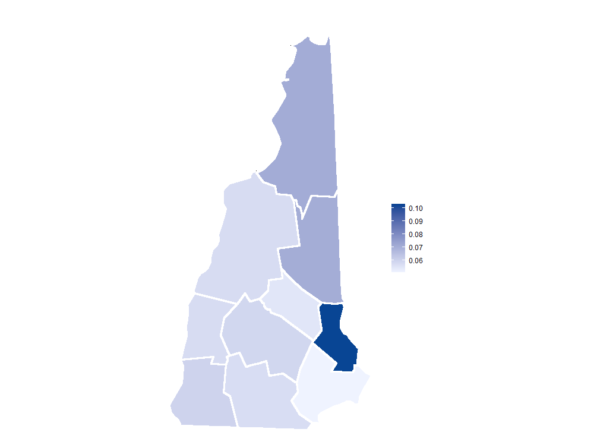

# Predicting Opioid Prescription in New Hampshire
Predicting opioid prescriptions in NH at the county level based on 2014 CMS data, using R
## Background
New Hampshire is currently third in the nation for drug deaths per capita, in no small part due to the opioid epidemic that shows little sign of slowing down. A key factor in this epidemic is the abuse of Schedule II opioid drugs prescribed to New Hampshire residents. While the state has implemented a new Prescription Drug Monitoring Program to keep track of how many Schedule II, III, and IV drugs are prescribed, it is still in its early phases. Our project focuses on using available data from the Centers for Medicaid & Medicare Services (CMS) to attempt to predict the likelihood of an opioid being prescribed in the state of New Hampshire.
## About the Data
The Centers for Medicaid & Medicare Services provide Public Use Files (“PUF”) to the public for research and analysis through their online portal, data.cms.gov. The two data sets we used in our analysis were from 2014, the most recent year available for the type of data we were looking for. The first is a summary table of all providers who utilized Medicare Part D in 2014. It lists information about the prescriber (such as their name, the location of their practice, and the number and types of claims submitted), but isn’t specific about which drugs were prescribed. The second data set used is more focused, with information on which prescriptions were provided in 2014 by these prescribers. By combining both data sets, we were able to design and build a model to predict the likelihood of opioid prescription in the state of New Hampshire.
## A Word of Warning
It would be nice if data analysis could solve our state’s addiction crisis, but we know it will take more than this. Our project isn’t meant to provide an overall solution to the epidemic, but rather to provide some insight into the data provided by CMS for 2014. By focusing our project on this topic, we hope to increase visibility of this topic as a viable research area in analytics, and inspire other researchers to build more sophisticated models.
## Materials & Methods
For this project, we worked in RStudio, an open-source integrated development environment. A lot of our inspiration both for this project, and for certain sections of the final implementation of our code, came from Alan Pryor Jr.’s Kaggle notebook, “Analyzing Opiate Prescriptions in the U.S. - How Could We Save Lives Using Predictive Modeling?”. Before we could begin building our model, the CMS data needed to be checked for errors and standardized. We took the detailed address data given to us in the CMS data and used it to create a slightly more useful ‘County’ feature. Because the observations in the CMS files had lots of levels, we decided to create dummy variables for each level in order to use the type of model we were interested in. We also decided not to truncate the drugs we would train our model on, as there were only a little more than 1200 unique drug names present, and it wasn’t overly resource intensive to simply keep all of the observations. We used a Gradient Boosted Classification Tree ensemble with gbm and caret to build our model. With so many features in play, the likelihood that some of them were highly correlated made this a good choice for a model. Because trees take a while to train, we kept the default parameters of the package we were using to minimize resources and time consumed. We used 5-fold cross validation to optimize the hyperparameters for our boosted tree ensemble.
## Results

Accuracy: 0.8341
Sensitivity : 0.8297
Specificity : 0.839
95% CI : (0.8078, 0.8581)
## Discussion
The features that showed the highest importance in our model were prescribers of the surgical specialty, and prescribers that also prescribed either Levothyorxine Sodium or Prednisone. Surgeons prescribing opioids is not all that surprising, in context. Recovering from a surgery can be a painful process, and opioids for pain management can be very effective. Prednisone is a corticosteroid, used often as an antiinflammatory. Inflammation often goes hand in hand with pain, so again the high importance assigned to it here is not that surprising. The most interesting high importance feature is then Levothyorxine Sodium. This drug is a thyroid hormone replacement, used primarily to treat hypothyroidism. At first glance, this might seem like an unusual factor to be so highly rated. However, when considering that hypothyroidism patients are much more likely to develop rheumatoid arthritis, the relationship becomes clearer. Rheumatoid arthritis can be debilitatingly painful– and is often treated with opioids. While our model won’t be predicting addicts before they fill their first prescription any time soon, it does lend some interesting insight towards the prescription and overprescription of opioid drugs in the Granite State.
## References
Centers for Medicaid & Medicare Services. (2016). Medicare Provider Utilization and Payment Data: Part D Prescriber Summary Table CY2014 [Data set]. Retrieved December 1, 2016, from https://data.cms.gov/Public-UseFiles/Medicare-Provider-Utilization-and-Payment-DataPar/mxq9-aiiw

Centers for Medicaid & Medicare Services. (2016). Medicare Provider Utilization and Payment Data: 2014 Part D Prescriber[Data set]. Retrieved December 1, 2016, from https://data.cms.gov/Public-Use-Files/Medicare-ProviderUtilization-and-Payment-Data-201/465c-49pb

Nilsen, E. (2016). Report: New Hampshire has third-highest drug deaths per capita in the nation, with little sign of slowing down. . Retrieved December 1, 2016, from Concord Monitor, http://www.concordmonitor.com/Articles/2016/03/FromArchives-1/DrugDeaths-cm-032116

Pryor, Jr, A. (2016). U.S. Opiate prescriptions/overdoses. Retrieved December 1, 2016, from Kaggle, https://www.kaggle.com/apryor6/d/apryor6/us-opiateprescriptions/detecting-frequent-opioid-prescription Wickham, S. (2015, October 18). 

Opioid user numbers in NH are staggering. Retrieved December 1, 2016, from Union Leader, http://www.unionleader.com/Opioid-user-numbersin-NH-are-staggering
